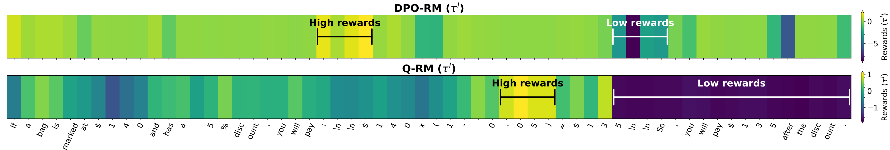
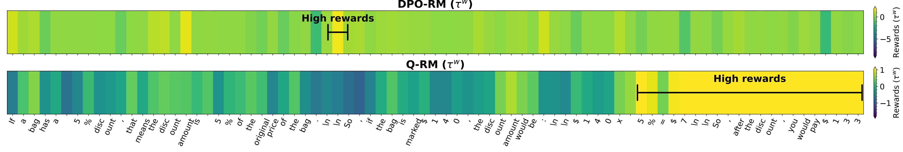

_**Prompt: bag has a 5\% discount. If it is marked \$140, how much will you pay after the discount?**_


Token credit assignment visualization of an example from GSM8K. We compare our method Q-RM with DPO-RM on trajectories $\tau^l$ and $\tau^w$.

# Discriminative Policy Optimization for Token-Level Reward Model 

<div align="center">
Hongzhan Chen<sup>1</sup>, Tao Yang<sup>2*</sup>, Shiping Gao<sup>1</sup>, Ruijun Chen<sup>1</sup>, Xiaojun Quan<sup>1*</sup>, Hongtao Tian<sup>2</sup>, Ting Yao<sup>2</sup>
</div>
<div align="center">
chenhzh59@mail2.sysu.edu.cn, luckytyang@tencent.com, quanxj3@mail.sysu.edu.cn
</div>
<div align="center">
<sup>1</sup>Sun Yat-sen University <sup>2</sup>Wechat Search, Tencent Inc
</div>
<div align="center">
*Corresponding authors
</div>


<div align="center">
    <a href="https://arxiv.org/pdf/2403.13679.pdf"></a>
</div>


## News

- [2025.05.02] Q-RM has been accepted to the ICML 2025.


## Introduction

Process reward models (PRMs) provide more nuanced supervision compared to outcome reward models (ORMs) for optimizing policy models, positioning them as a promising approach to enhancing the capabilities of LLMs in complex reasoning tasks.

In this study, we revisit token-level reward modeling through the framework of the Bradley-Terry model and maximum entropy RL. We decouple token reward modeling from language generation and derive a token-level reward model by optimizing a discriminative policy, which we term the Q-function Reward Model (Q-RM). Q-RM defines token-level credits using the logits of the discriminative model and can be trained from preference data without requiring fine-grained annotations. 

Furthermore, we provide theoretical insights suggesting that computing advantage functions from the logits of the discriminative policy can align with leveraging optimal Q-functions. This property enables Q-RM to substitute Q-functions and directly deliver token-level supervised signals for policy optimization. Consequently, integrating Q-RM with PPO may simplify the estimation of advantage and potentially reduce the reliance on GAE.


## Requirement

| Library        | Recommend | 
|----------------|-----------|
| python         | \>=3.10   | 
| torch          | \>=2.0.0  | 
| transformers   | \>=4.51.0 |

## Environment Setup

```
conda create -n qrm python=3.10
conda activate qrm

pip install -r requirements.txt
```

## Reward Model Training
Before the training process starts, you should follow the instructions in the training scripts in `scripts` directory to prepare your data and model checkpoints.

```shell
cd scripts

sh train-q-rm.sh
```

## REINFORCE Training
```shell
cd scripts

sh train-reinforce-with-q-rm.sh
```

## PPO Training 
```shell
cd scripts

sh train-ppo-with-q-rm.sh
```

## Citation
```
@misc{chen2025discriminativepolicyoptimizationtokenlevel,
      title={Discriminative Policy Optimization for Token-Level Reward Models}, 
      author={Hongzhan Chen and Tao Yang and Shiping Gao and Ruijun Chen and Xiaojun Quan and Hongtao Tian and Ting Yao},
      year={2025},
      eprint={2505.23363},
      archivePrefix={arXiv},
      primaryClass={cs.CL},
      url={https://arxiv.org/abs/2505.23363}, 
}
```
